# Reflection Tree — Full Branch Diagram

```mermaid
flowchart TD
    START([🌙 START\nGood evening. Let's look at your day.])
    START --> A1_OPEN

    A1_OPEN[/"A1_OPEN ❓\nHow would you describe today\nin one word?\n—\nProductive · Mixed · Tough · Frustrating"/]
    A1_OPEN --> D1

    D1{{"D1 🔀\nRoute by mood"}}
    D1 -->|Productive or Mixed| A1_Q_AGENCY_HIGH
    D1 -->|Tough or Frustrating| A1_Q_AGENCY_LOW

    %% ── HIGH BRANCH ──────────────────────────────────
    A1_Q_AGENCY_HIGH[/"A1_Q_AGENCY_HIGH ❓\nWhen it went well —\nwhat made it happen?\n—\nI prepared · Team came through\nI adapted · Just worked out"/]
    A1_Q_AGENCY_HIGH --> A1_Q2_HIGH

    A1_Q2_HIGH[/"A1_Q2_HIGH ❓\nDid you notice the moment\nyou had a choice?\n—\nYes deliberately · Noticed after\nJust reacted · No choice to notice"/]
    A1_Q2_HIGH --> A1_R_INT

    A1_R_INT[["A1_R_INT 💬\n'You stayed in the driver's seat.\nThat gap between what happens\nand how we respond —\nthat's where character lives.'"]]

    %% ── LOW BRANCH ───────────────────────────────────
    A1_Q_AGENCY_LOW[/"A1_Q_AGENCY_LOW ❓\nWhen things got hard —\nwhat was your first move?\n—\nLooked for control · Waited\nPushed through alone · Felt stuck"/]
    A1_Q_AGENCY_LOW --> A1_Q2_LOW

    A1_Q2_LOW[/"A1_Q2_LOW ❓\nWas there even one small moment\nwhere you made a call?\n—\nChose how I spoke · Chose to continue\nMaybe · No say at all"/]
    A1_Q2_LOW --> A1_R_EXT

    A1_R_EXT[["A1_R_EXT 💬\n'A hard day pulls attention outward.\nBut you made at least one call today.\nNoticing that is the whole game.'"]]

    %% ── BRIDGE 1→2 ───────────────────────────────────
    A1_R_INT --> BRIDGE_1_2
    A1_R_EXT --> BRIDGE_1_2

    BRIDGE_1_2(["─── BRIDGE 1→2 ───\nNow let's shift from how you\nhandled things — to what you gave."])
    BRIDGE_1_2 --> A2_OPEN

    %% ═══════════════════════════════════════════════
    %% AXIS 2
    %% ═══════════════════════════════════════════════

    A2_OPEN[/"A2_OPEN ❓\nThink of one interaction today.\nGiving or expecting?\n—\nHelped someone · Taught someone\nNeeded support · Felt overlooked"/]
    A2_OPEN --> D_A2

    D_A2{{"D_A2 🔀\nRoute by orientation"}}
    D_A2 -->|Helped or Taught| A2_Q_CONTRIB
    D_A2 -->|Needed support or Felt overlooked| A2_Q_ENTITLE

    %% ── CONTRIB BRANCH ───────────────────────────────
    A2_Q_CONTRIB[/"A2_Q_CONTRIB ❓\nWhen you gave that help —\nwhat was going on internally?\n—\nFelt natural · Deliberate choice\nPartly hoping to be noticed · Obligation"/]
    A2_Q_CONTRIB --> A2_Q2_CONTRIB

    A2_Q2_CONTRIB[/"A2_Q2_CONTRIB ❓\nDid today's contribution feel like\na choice or automatic?\n—\nDeliberate · Automatic · Both · Unsure"/]
    A2_Q2_CONTRIB --> A2_R_CONTRIB

    A2_R_CONTRIB[["A2_R_CONTRIB 💬\n'Giving without tallying —\nthat's real contribution.\nYou were that person today.'"]]

    %% ── ENTITLE BRANCH ───────────────────────────────
    A2_Q_ENTITLE[/"A2_Q_ENTITLE ❓\nWhen you felt unseen —\nwhat did you want specifically?\n—\nRecognition · More resources\nSomeone else to step up · To matter"/]
    A2_Q_ENTITLE --> A2_Q2_ENTITLE

    A2_Q2_ENTITLE[/"A2_Q2_ENTITLE ❓\nDid feeling overlooked affect\nhow much you gave today?\n—\nYes pulled back · Yes gave more\nNo same regardless · Unsure"/]
    A2_Q2_ENTITLE --> A2_R_ENTITLE

    A2_R_ENTITLE[["A2_R_ENTITLE 💬\n'Noticing the gap between\nwhat you gave and what you expected\nis the honest part. You're looking.'"]]

    %% ── BRIDGE 2→3 ───────────────────────────────────
    A2_R_CONTRIB --> BRIDGE_2_3
    A2_R_ENTITLE --> BRIDGE_2_3

    BRIDGE_2_3(["─── BRIDGE 2→3 ───\nOne more lens — who was\nin your frame of mind today?"])
    BRIDGE_2_3 --> A3_OPEN

    %% ═══════════════════════════════════════════════
    %% AXIS 3
    %% ═══════════════════════════════════════════════

    A3_OPEN[/"A3_OPEN ❓\nToday's most difficult moment —\nwho came to mind?\n—\nMostly myself · My team\nA specific colleague · The customer"/]
    A3_OPEN --> D_A3

    D_A3{{"D_A3 🔀\nRoute by radius"}}
    D_A3 -->|Myself only| A3_Q_SELF
    D_A3 -->|Team · Colleague · Customer| A3_Q_OTHER

    %% ── SELF BRANCH ──────────────────────────────────
    A3_Q_SELF[/"A3_Q_SELF ❓\nWas anyone else affected\nby how it went for you?\n—\nProbably, didn't think of it · Yes aware\nMaybe · Not really"/]
    A3_Q_SELF --> A3_Q2_SELF

    A3_Q2_SELF[/"A3_Q2_SELF ❓\nTomorrow — whose perspective\nwould be most useful to consider?\n—\nManager · Teammate downstream\nCustomer · Don't know yet"/]
    A3_Q2_SELF --> A3_R_SELF

    A3_R_SELF[["A3_R_SELF 💬\n'Being absorbed in your own problem\nis focus, not failure. But the most\ndurable meaning comes from knowing\nyour work connects to someone else.'"]]

    %% ── OTHER BRANCH ─────────────────────────────────
    A3_Q_OTHER[/"A3_Q_OTHER ❓\nYou thought of someone else\nin that hard moment. What did\nthat awareness do for you?\n—\nMore worth solving · Gave perspective\nHarder — felt responsible · Just noticed"/]
    A3_Q_OTHER --> A3_Q2_OTHER

    A3_Q2_OTHER[/"A3_Q2_OTHER ❓\nThat awareness of someone else —\ndid you carry it into action?\n—\nChanged what I did · Shaped how I showed up\nMore a feeling · Unsure it changed anything"/]
    A3_Q2_OTHER --> A3_R_OTHER

    A3_R_OTHER[["A3_R_OTHER 💬\n'You kept others in view\neven when it cost you something.\nMaslow called that self-transcendence.\nYou were doing that today.'"]]

    %% ── SUMMARY ──────────────────────────────────────
    A3_R_SELF --> SUMMARY
    A3_R_OTHER --> SUMMARY

    SUMMARY[["SUMMARY 📋\nToday you leaned {axis1} on agency,\n{axis2} on contribution,\n{axis3} on radius.\n{closing_note}"]]
    SUMMARY --> END

    END([👋 END\nSee you tomorrow.])

    %% ── STYLES ───────────────────────────────────────
    classDef startEnd fill:#2C2C2A,stroke:#5F5E5A,color:#D3D1C7
    classDef question fill:#042C53,stroke:#185FA5,color:#B5D4F4
    classDef decision fill:#412402,stroke:#854F0B,color:#FAC775
    classDef reflection fill:#04342C,stroke:#0F6E56,color:#9FE1CB
    classDef bridge fill:#1a1a1d,stroke:#444441,color:#888780
    classDef summary fill:#26215C,stroke:#534AB7,color:#CECBF6

    class START,END startEnd
    class A1_OPEN,A1_Q_AGENCY_HIGH,A1_Q_AGENCY_LOW,A1_Q2_HIGH,A1_Q2_LOW question
    class A2_OPEN,A2_Q_CONTRIB,A2_Q_ENTITLE,A2_Q2_CONTRIB,A2_Q2_ENTITLE question
    class A3_OPEN,A3_Q_SELF,A3_Q_OTHER,A3_Q2_SELF,A3_Q2_OTHER question
    class D1,D_A2,D_A3 decision
    class A1_R_INT,A1_R_EXT,A2_R_CONTRIB,A2_R_ENTITLE,A3_R_SELF,A3_R_OTHER reflection
    class BRIDGE_1_2,BRIDGE_2_3 bridge
    class SUMMARY summary
```

## Node count
| Type | Count |
|------|-------|
| Start / End | 2 |
| Question | 13 |
| Decision (hidden) | 3 |
| Reflection | 6 |
| Bridge | 2 |
| Summary | 1 |
| **Total** | **27** |

## Possible unique paths
There are **8 distinct conversation paths** through the tree (2 branches at D1 × 2 at D_A2 × 2 at D_A3).
Every path visits exactly: START → 1 opening Q → 1 follow-up Q → 1 reflection → BRIDGE → 1 opening Q → 1 follow-up Q → 1 reflection → BRIDGE → 1 opening Q → 1 follow-up Q → 1 reflection → SUMMARY → END.
